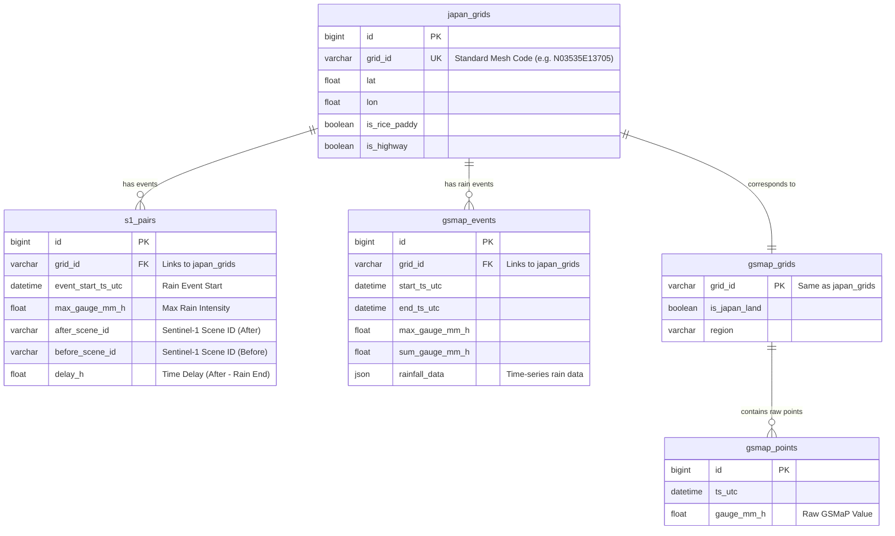

# データの概要

各グリッドのデータはMySQLのrainsar_hubに格納されている

```bash
docker exec -it rainsarhub-db mysql -u rainsar -prainsar_pw rainsar_hub
```

でアクセス可能
dbの構造は以下のようになっている．



これらのデータは，GSMapによる降雨イベントの取得が0.1°グリッド（10km × 10km）で行われていることから，各グリッドごとの降雨イベント（7mm/hの雨が降る・降り続く）を捉えている．また，降雨イベントが終了してから撮影された衛星画像と比較対象である降雨前の衛星画像を格納している．

# 取得データについて
## データの選定
降雨イベントについて，以下のような条件を満たすデータを取得しようと考えている．

1. 降雨が始まってから終わるまでの平均が10mm/hである
2. 衛星画像が降雨前（Before）と降雨後（After）に存在している
3. 降雨量と降雨継続時間から降雨強度を算出可能である(おそらく`gsmap_points` に各時刻の降水量データが格納されている？)
4. Delay（降雨が終了してから衛星画像が撮影されるまでの経過時間）が12h以内である

また，取得するグリッドについては以下のような基準を考えている．

1. グリッドに条件を満たす降雨イベントが5つ以上存在する
2. 降雨イベントのDelayが0.2h, 3.6h, 5.4h, 8.1h, 9.7hのように，均等に分布している
3. グリッド内に道路および田んぼが存在している．
	- 道路については，OSMより高速道路（motorway）および幹線道路（trunk）が含まれていることを，「道路が存在している」と定義づける．高速道路や幹線道路については，トンネルや道路が見えていない区間を除くこととする．
	- 田んぼについては，`D:\sotsuron\fude-polygon` に格納されているzipファイル内にて定義されたgeojsonデータを参照することとする．zipファイルは`2021_〇〇.zip` のような命名規則となっており，〇〇には「01」，「42」といった二桁の数字が入っている．これらの数字は都道府県のIDを示しており，01 ~ 47まで存在する．データの形式は以下のようになっている．各座標をもとにして，グリッド内に田んぼが存在しているかを確認する．なお，`D:\sotsuron\fude-polygon` 内のすべてのzipファイルを走査することは非常に効率が悪いため，グリッドの範囲に対応している都道府県に当たりをつけて，そのフォルダの筆ポリゴンを参照していくと良い．なお，都道府県のIDは以下のように対応づけられている．
	```json
	{"type":"FeatureCollection","features":[{"type":"Feature","geometry":{"type":"Polygon","crs":{"type":"name","properties":{"name":"EPSG:6668"}},"coordinates":[[[141.272640854,43.029902509],[141.272772199,43.030040347],[141.272820349,43.03010595],[141.272868574,43.030166897],[141.272899401,43.030224204],[141.272911577,43.030256903],[141.272926769,43.030279303],[141.272966926,43.030281974],[141.273004292,43.030260562],[141.273145133,43.030184931],[141.273189239,43.030138742],[141.273272352,43.029939167],[141.273316021,43.029887154],[141.273384264,43.029786456],[141.27330927,43.029712475],[141.273564197,43.029547014],[141.273641903,43.029449889],[141.273729295,43.02934237],[141.273831243,43.029217512],[141.273400929,43.02873538],[141.273358092,43.028735014],[141.273112972,43.028949617],[141.272939332,43.029092488],[141.272719604,43.029339737],[141.272560497,43.02956655],[141.272685468,43.029691016],[141.272758562,43.029684656],[141.272831915,43.029662],[141.27285077,43.029673802],[141.273132669,43.029508573],[141.273185876,43.029555592],[141.273127983,43.029603992],[141.272640854,43.029902509]]]},"properties":{"polygon_uuid":"76a3cbd6-1ab3-479f-9eb3-9d86f3d0680a","land_type":200,"issue_year":2021,"edit_year":2020,"history":"{\"筆ポリゴンID\":\"76a3cbd6-1ab3-479f-9eb3-9d86f3d0680a\",\"発生年度\":2020}","last_polygon_uuid":null,"prev_last_polygon_uuid":null,"local_government_cd":"011011","point_lng":141.273173816,"point_lat":43.029467047,"old_polygon_id":"0112-107355-079606"}},
{"type":"Feature","geometry":{"type":"Polygon","crs":{"type":"name","properties":{"name":"EPSG:6668"}},"coordinates":[[[141.258993791,43.043309391],[141.258974796,43.043334143],[141.258902917,43.043398084],[141.258781334,43.043482067],[141.258988237,43.043699597],[141.259029761,43.043702739],[141.259169017,43.043721267],[141.259357771,43.043722716],[141.259493897,43.043713396],[141.259509251,43.043737675],[141.259582559,43.043718363],[141.25960357,43.04374689],[141.259751715,43.043751624],[141.260116719,43.043750584],[141.260198765,43.043721898],[141.260284836,43.043710044],[141.260326457,43.043703055],[141.260370399,43.043729682],[141.260440778,43.043714542],[141.260515264,43.043710987],[141.260585304,43.043716842],[141.260739899,43.043716078],[141.260897745,43.043691198],[141.261265149,43.043585195],[141.261268382,43.043562126],[141.261254981,43.043505321],[141.260916996,43.043034333],[141.260856628,43.043051387],[141.260788742,43.043067334],[141.26059895,43.043135607],[141.260480808,43.04313931],[141.26025518,43.043151531],[141.260046397,43.04318437],[141.259910676,43.043213115],[141.259755938,43.043222799],[141.259635724,43.043221759],[141.259562688,43.043224276],[141.259395222,43.043224402],[141.259260083,43.043216933],[141.259104712,43.043265979],[141.258993791,43.043309391]]]},"properties":{"polygon_uuid":"29ac6491-7380-473a-b9bd-cc8c2c7cc9de","land_type":200,"issue_year":2021,"edit_year":2020,"history":"{\"筆ポリゴンID\":\"29ac6491-7380-473a-b9bd-cc8c2c7cc9de\",\"発生年度\":2020}","last_polygon_uuid":null,"prev_last_polygon_uuid":null,"local_government_cd":"011011","point_lng":141.260080561,"point_lat":43.04345044,"old_polygon_id":"0112-105789-080654"}},
{"type":"Feature","geometry":{"type":"Polygon","crs":{"type":"name","properties":{"name":"EPSG:6668"}},"coordinates":[[[141.258993791,43.043309391],[141.259104712,43.043265979],[141.259260083,43.043216933],[141.259395222,43.043224402],[141.259562688,43.043224276],[141.259635724,43.043221759],[141.259755938,43.043222799],[141.259910676,43.043213115],[141.260046397,43.04318437],[141.26025518,43.043151531],[141.260480808,43.04313931],[141.26059895,43.043135607],[141.260788742,43.043067334],[141.260856628,43.043051387],[141.260916996,43.043034333],[141.260907788,43.043021501],[141.260801318,43.042877804],[141.260745625,43.042780739],[141.260700268,43.042753052],[141.260637435,43.04274411],[141.26047944,43.042778438],[141.260272451,43.042833338],[141.260125633,43.04288456],[141.260070374,43.042938672],[141.259937902,43.042987918],[141.259854459,43.043014491],[141.259742663,43.043024022],[141.259622856,43.04299779],[141.2594916,43.042971458],[141.259377178,43.042966268],[141.259216726,43.042975377],[141.259041793,43.042994859],[141.258949864,43.04301506],[141.258931846,43.043067395],[141.258946856,43.043201902],[141.258993791,43.043309391]]]},"properties":{"polygon_uuid":"1260ed49-3d13-479d-8a60-c96b35837a34","land_type":200,"issue_year":2021,"edit_year":2020,"history":"{\"筆ポリゴンID\":\"1260ed49-3d13-479d-8a60-c96b35837a34\",\"発生年度\":2020}","last_polygon_uuid":null,"prev_last_polygon_uuid":null,"local_government_cd":"011011","point_lng":141.259948641,"point_lat":43.043042925,"old_polygon_id":"0112-105834-080666"}},
{"type":"Feature","geometry":{"type":"Polygon","crs":{"type":"name","properties":{"name":"EPSG:6668"}},"coordinates":[[[141.264927019,43.035260401],[141.264941806,43.03526449],[141.265142781,43.035233677],[141.26498857,43.034957832],[141.264972591,43.034943828],[141.264963092,43.034946717],[141.264800052,43.035009698],[141.264794525,43.035017574],[141.264791794,43.035019532],[141.26483222,43.035109026],[141.264927019,43.035260401]]]},"properties":{"polygon_uuid":"db9275eb-840c-42ff-bf7d-a0b103fa94f0","land_type":100,"issue_year":2021,"edit_year":2020,"history":"{\"筆ポリゴンID\":\"db9275eb-840c-42ff-bf7d-a0b103fa94f0\",\"発生年度\":2020}","last_polygon_uuid":null,"prev_last_polygon_uuid":null,"local_government_cd":"011011","point_lng":141.264960696,"point_lat":43.035113413,"old_polygon_id":"0112-106720-080268"}},
{"type":"Feature","geometry":{"type":"Polygon","crs":{"type":"name","properties":{"name":"EPSG:6668"}},"coordinates":[[[141.26498857,43.034957832],[141.265142781,43.035233677],[141.265259902,43.035215722],[141.265270766,43.035211853],[141.265276277,43.035204967],[141.26523037,43.035120377],[141.265156872,43.034988006],[141.265117681,43.034919066],[141.26498857,43.034957832]]]},"properties":{"polygon_uuid":"120f0b39-2fcb-4de4-8e54-75d5d1409bc2","land_type":100,"issue_year":2021,"edit_year":2020,"history":"{\"筆ポリゴンID\":\"120f0b39-2fcb-4de4-8e54-75d5d1409bc2\",\"発生年度\":2020}","last_polygon_uuid":null,"prev_last_polygon_uuid":null,"local_government_cd":"011011","point_lng":141.265133066,"point_lat":43.035080164,"old_polygon_id":"0112-106724-080254"}},
{"type":"Feature","geometry":{"type":"Polygon","crs":{"type":"name","properties":{"name":"EPSG:6668"}},"coordinates":[[[141.265117681,43.034919066],[141.265156872,43.034988006],[141.26523037,43.035120377],[141.265340218,43.035090617],[141.265345713,43.035084721],[141.265239223,43.034904521],[141.265129675,43.034915464],[141.265117681,43.034919066]]]},"properties":{"polygon_uuid":"55da65d1-5315-46f1-af53-1ff04752dd9a","land_type":100,"issue_year":2021,"edit_year":2020,"history":"{\"筆ポリゴンID\":\"55da65d1-5315-46f1-af53-1ff04752dd9a\",\"発生年度\":2020}","last_polygon_uuid":null,"prev_last_polygon_uuid":null,"local_government_cd":"011011","point_lng":141.265233097,"point_lat":43.035008463,"old_polygon_id":"0112-106732-080245"}},
{"type":"Feature","geometry":{"type":"Polygon","crs":{"type":"name","properties":{"name":"EPSG:6668"}},"coordinates":[[[141.269019739,43.0343584],[141.269109541,43.034349426],[141.269306131,43.034307263],[141.269589863,43.034214692],[141.269606774,43.034195349],[141.269613918,43.034163742],[141.269505297,43.033894855],[141.269479434,43.033850786],[141.26942998,43.033828438],[141.269366973,43.033823027],[141.269293929,43.033822401],[141.269153588,43.033877225],[141.269033131,43.033934656],[141.268972552,43.033985292],[141.268964981,43.034043691],[141.268979331,43.034185099],[141.268990284,43.034331352],[141.269019739,43.0343584]]]},"properties":{"polygon_uuid":"0d428f02-c58b-48ff-91a1-6a20d8929b68","land_type":200,"issue_year":2021,"edit_year":2020,"history":"{\"筆ポリゴンID\":\"0d428f02-c58b-48ff-91a1-6a20d8929b68\",\"発生年度\":2020}","last_polygon_uuid":null,"prev_last_polygon_uuid":null,"local_government_cd":"011011","point_lng":141.269267076,"point_lat":43.034090353,"old_polygon_id":"0112-106838-079918"}},
{"type":"Feature","geometry":{"type":"Polygon","crs":{"type":"name","properties":{"name":"EPSG:6668"}},"coordinates":[[[141.26908475,43.033404057],[141.269123351,43.033482339],[141.269149253,43.033523973],[141.269182066,43.033548613],[141.269248393,43.033554053],[141.269305146,43.033535052],[141.26943869,43.033489914],[141.269551887,43.033471396],[141.269641531,43.033472164],[141.269681644,43.033455455],[141.269695352,43.033428777],[141.269655872,43.033197021],[141.269633988,43.033111575],[141.269589484,43.03298696],[141.269525136,43.032857302],[141.269478848,43.032844725],[141.26940596,43.032834356],[141.269312608,43.032857916],[141.269128914,43.032924549],[141.269072278,43.032936243],[141.269032048,43.032960259],[141.269004905,43.032996565],[141.268994596,43.033018401],[141.269079584,43.033311446],[141.269068731,43.03336738],[141.26908475,43.033404057]]]},"properties":{"polygon_uuid":"cfe689ec-007b-4c03-b1cf-644c0b5e0bca","land_type":200,"issue_year":2021,"edit_year":2020,"history":"{\"筆ポリゴンID\":\"cfe689ec-007b-4c03-b1cf-644c0b5e0bca\",\"発生年度\":2020}","last_polygon_uuid":null,"prev_last_polygon_uuid":null,"local_government_cd":"011011","point_lng":141.269346644,"point_lat":43.033195847,"old_polygon_id":"0112-106937-079913"}}]}
	```

```json
{
  "01": "北海道",
  "02": "青森県",
  "03": "岩手県",
  "04": "宮城県",
  "05": "秋田県",
  "06": "山形県",
  "07": "福島県",
  "08": "茨城県",
  "09": "栃木県",
  "10": "群馬県",
  "11": "埼玉県",
  "12": "千葉県",
  "13": "東京都",
  "14": "神奈川県",
  "15": "新潟県",
  "16": "富山県",
  "17": "石川県",
  "18": "福井県",
  "19": "山梨県",
  "20": "長野県",
  "21": "岐阜県",
  "22": "静岡県",
  "23": "愛知県",
  "24": "三重県",
  "25": "滋賀県",
  "26": "京都府",
  "27": "大阪府",
  "28": "兵庫県",
  "29": "奈良県",
  "30": "和歌山県",
  "31": "鳥取県",
  "32": "島根県",
  "33": "岡山県",
  "34": "広島県",
  "35": "山口県",
  "36": "徳島県",
  "37": "香川県",
  "38": "愛媛県",
  "39": "高知県",
  "40": "福岡県",
  "41": "佐賀県",
  "42": "長崎県",
  "43": "熊本県",
  "44": "大分県",
  "45": "宮崎県",
  "46": "鹿児島県",
  "47": "沖縄県"
}

```

グリッドの選定は，上記の基準を満たしたグリッドの中で特に降雨イベント数が多く，またその降雨イベント一つ一つの降雨強度が強いものを優先的に選定し，上位200グリッド〜300グリッドを選ぶ

加えて，グリッドの選定を行う際に使用した道路，および田んぼのデータについてはのちにマスクデータとして使用するためにgeojsonのかたちで出力しておく．
具体的には，そのグリッドに含まれている道路，および田んぼをgeojsonの形式で保存し，`D:\sotsuron\rainsar-hub\data\expanded\masks` に各グリッドごとにフォルダを作成して格納する．（ex: `D:\sotsuron\rainsar-hub\data\expanded\masks\N03145E13035\N03145E13035_paddy.geojson`）
これらのgeojsonデータは前処理が完了した衛星データ（.tifファイル）に対して，マスキングを行い，道路および田んぼの後方散乱強度の算出を行う際に使用される．

## 取得データのダウンロード
データのダウンロードは`D:\sotsuron\rainsar-hub\backend\app\services\s1_cdse_client.py` を使用したダウンロードを行う．
過去にデータダウンロードを行ったスクリプト群は`D:\sotsuron\rainsar-hub\scripts\download` に格納されているため，参考にすること．

また，データのダウンロードに際して，すでにダウンロードされているデータを事前に確認することが必須である．すでにダウンロードされているデータは`D:\sotsuron\rainsar-hub\data\final\SAFE` に格納されており，特にグリッドごとにフォルダ分けなどがされているわけではなく，このフォルダ直下に衛星データが格納されている．（ex: `D:\sotsuron\rainsar-hub\data\final\SAFE\S1A_IW_GRDH_1SDV_20180621T211723_20180621T211748_022460_026EBC_1A54.zip`）

## 取得データの前処理
衛星データの前処理を行うためのスクリプトは`D:\sotsuron\rainsar-hub\scripts\archive\preprocess_s1_cog.py` に格納されているものを使用する．その際に，衛星の偏波として，VVとVHを選択できるような実装となっているはずだが，これに対して，VVを用いて前処理したデータとVHを用いて前処理したデータを作成する．
前処理を行う際は`D:\sotsuron\rainsar-hub\data\expanded\samples`にデータを各グリッド，各降雨イベントごとにフォルダ分けを行っていく．（ex: `D:\sotsuron\rainsar-hub\data\expanded\samples\N03145E13075\delay_6h_20190721` ）各降雨イベント後とのフォルダには「after_vv.tif」と「before_vv.tif」で示された降雨前後の前処理後の衛星画像が格納される．

# 取得データの分析

データの分析はVVおよびVHの両方の衛星データそれぞれで行う．`D:\sotsuron\rainsar-hub\data\result\vv`と`D:\sotsuron\rainsar-hub\data\result\vh`フォルダを作成して，それぞれの偏波のデータを用いた以下の分析を行う．
## 道路および田んぼの後方散乱強度の分布
道路と田んぼでマスクされたピクセル1つ1つに対して後方散乱強度の算出を行う．加えて，その衛星画像の道路と田んぼの後方散乱強度の値の分布をヒストグラムで可視化する．また，可視化だけでなく，各ピクセルごとの後方散乱強度のcsvデータも作成する．csvデータを参照して，その衛星画像の道路と田んぼの分布について，統計的な分析を行い，ノイズデータを除去した後方散乱強度の値の統計的な分析結果をcsvで出力する．これらはすべて`D:\sotsuron\rainsar-hub\data\result\..\sigma`に各グリッド，各降雨イベントごとにフォルダ分けして格納する．

また，`D:\sotsuron\rainsar-hub\data\result\..\sigma`直下にすべてのグリッドの全ての降雨イベントを対象にした分析を行った結果を出力する．
具体的には，時系列を追ったの後方散乱強度の分布（Before/After, Road/Paddy別），グリッド全体を見た時の外れ値を除外しての後方散乱強度の分布を示す．それ以外にも必要と考えられる分析を行い，その結果をわかりやすい形で可視化したデータと数値的なcsvデータで出力する．また，これらについて，時期的な分析も行う．この時期の降雨前の田んぼの後方散乱強度はどうだ，降雨後の道路の後方散乱強度はこうだ，というように時期によって後方散乱強度自体が変化しているかを分析する．
## 後方散乱強度の差分の算出
各降雨イベントに対して，(Afterの後方散乱強度) - (Beforeの後方散乱強度)の差分を算出する．
また，これらについてもピクセル1つ1つに対して後方散乱強度差分の算出を行い，その分布を明らかにする．これについてもわかりやすいヒストグラムによる可視化と数値的なcsvデータの分析結果を出力する．
加えて，前段で分析したピクセル1つ1つに対して後方散乱強度の算出結果とその分布を確認し，その衛星画像でもっとも確からしい値となる平均値もしくは中央値の値から選出（全体的に外れ値の影響が大きそうな場合には，中央値を選択した方が確からしいが，ノイズデータが少数で基本的にはデータ分布がまとまっている場合には平均値を使用することを考える）した場合，どのような値となっているかを出力する．
さらに，差分を算出したのちにその差分が各グリッドごとに時系列的に見た時にどのように変化しているかを分析し，グラフとcsvデータで出力する．

加えて，これについても全体で見た時の分析結果を出力する．
データは`D:\sotsuron\rainsar-hub\data\result\..\diff`に格納する．各降雨イベントのデータは各グリッド，各降雨イベントごとにフォルダ分けし，直下にすべてのグリッドの全ての降雨イベントを対象にした分析を行った結果を出力する．全体で見る際には，日付の傾向も確認する．何月だと後方散乱強度差分がこれくらいになるな，その傾向は時期によってこう変化するな，ということを分析する．

## VVとVHの違いの分析
後方散乱強度の算出および後方散乱強度差分の算出結果に対して，VVとVHの偏波でどのような違いが見えているかを分析する．

これは偏波によって，道路と田んぼの後方散乱強度に違いがあるか，また，差分を算出した際に，その大きさや時系列の傾向の違いを明らかにし，本研究で使用する偏波としてどちらが正しいかを見極めることにある．

## 道路と田んぼの判別
道路と田んぼの判別は，「後方散乱強度差分」，「時期」，「降雨強度」の3つの特徴量を用いて分析を行う．具体的には，検証用データと学習用データを用意し，学習用データで特徴量を用いた道路と田んぼの判別を行い，精度を95%以上としたのちに学習用データでその判別が確かにできるかを確認する．
学習用データと検証用データは切り分ける必要があるため，学習用データが検証用データとならないように，またその逆も然りで注意して実装を行う．
その際に，全グリッドで道路と田んぼのピクセルがいくつあるかを確認し，全体的にデータの偏りがあるかどうかを確認する．データの偏りがある場合には，過学習となる可能性を考えて，データを増やす，ノイズデータを除去する，あるいは揃える，といったことを考える．

# 取得データの分析内容の意図について
## 各衛星画像の後方散乱強度の分析
- 今回道路と田んぼの差分変化から降雨後の水たまりの状態変化を捉えることが目的である．
- そのため，まずは降雨前の衛星画像から元々の道路・田んぼの後方散乱強度の大きさを把握する．その分布から道路は基本的にこの後方散乱強度で示される，田んぼは基本的にこの後方散乱強度で示される，という基準の強度の範囲を明らかにするためである．
- また，それらの全体の傾向に影響を及ぼしていそうな撮影時期との関連性を明らかにする．
- step1として，衛星画像の対象ピクセル全ての後方散乱強度について，算出を行う．この算出は道路・田んぼマスクをされたデータに対して行われるものである．また，数値的な分析とヒストグラム，箱ひげ図の可視化による分析を行う．
- step2として，これら各衛星画像に対して，道路と田んぼの後方散乱強度として外れ値（ノイズ）となっているデータを除去する．この除去したデータは数値的な把握のみで構わない．
- step3として，ノイズを除去したデータを対象として，降雨前後の全体的な後方散乱強度の分布，全体を通してノイズを除去したデータの分布，を調査する．その傾向から道路と田んぼで特徴的な違いがあるかを確認する．
- step4として，ノイズを除去したデータを対象として，降雨前の時期的な後方散乱強度の分布（1月〜12月ごとにヒストグラムで後方散乱強度の分布）を確認する．
## 後方散乱強度差分の分析
- ノイズを除去したデータを対象として後方散乱強度差分を算出する．
- 各降雨イベントごとに後方散乱強度差分を算出し，降雨イベントごとの差分の分布を示す．
- 降雨イベントごとに降雨強度（降水量×降雨継続時間）を算出する．降雨強度と後方散乱強度差分の分布を対応づけて，全体的な傾向として，降雨強度に対して後方散乱強度差分はこのように変化する．というのを分析する．
- 後方散乱強度差分の全体的な分布を明らかにする．
- 各降雨イベントの降雨強度と後方散乱強度差分の関係から全体的に降雨強度と後方散乱強度差分に関係があるかを分析する．
- 後方散乱強度差分の分布が各時期ごとに変わるかを確認する
## 道路と田んぼの判別
- ここまでの結果をもとに特徴量を「後方散乱強度差分」「降雨強度」「時期」の3つとして，これらの結果をもとに判別を行う．
